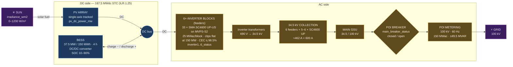
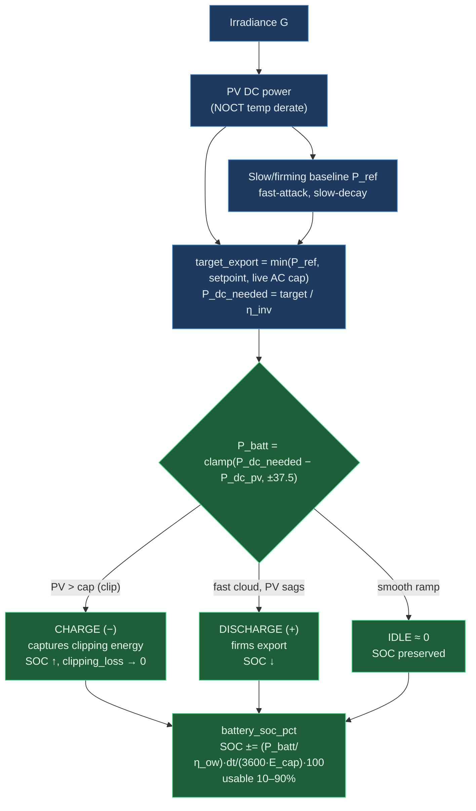
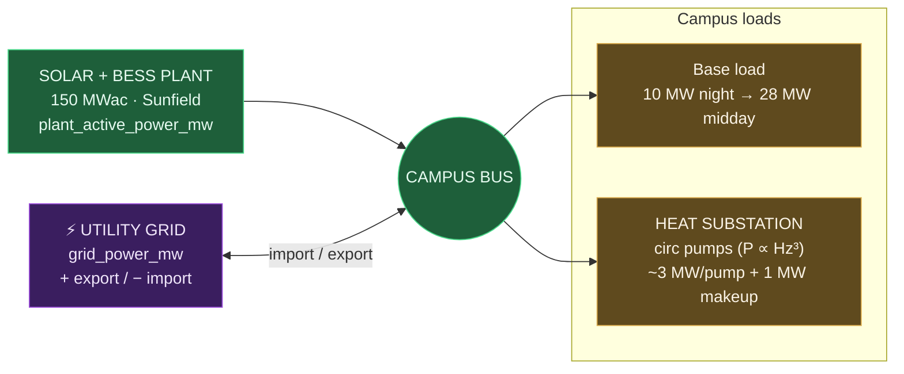
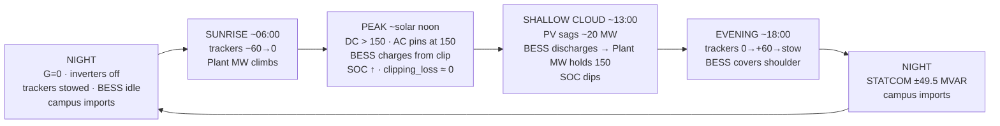

# Sunfield Solar — Power Plant Diagram

Mermaid diagrams describing the `Sunfield Solar — 150 MWac utility-scale PV + DC-coupled BESS`
plant and its place in the campus microgrid. See [POWERPLANT_SPEC.md](POWERPLANT_SPEC.md) for
the full physics model, point list, and FUXA view design.

## Electrical single-line (DC-coupled BESS)

The headline topology: PV array and a **DC-coupled** battery share the inverter blocks, so the
battery charges from DC **clipping** energy at peak (SOC rises) and discharges through the same
inverters to firm export on a passing cloud.

## DC-coupled BESS dispatch (auto firming law)

## Campus microgrid coupling

The solar+BESS plant feeds a campus bus; the district-heating substation's circulation pumps are
an electrical load on it. A pump trip drops campus load → plant export to the grid rises; at night
solar = 0 so the campus imports from the grid.

## Day-in-the-life arc (24 h)

